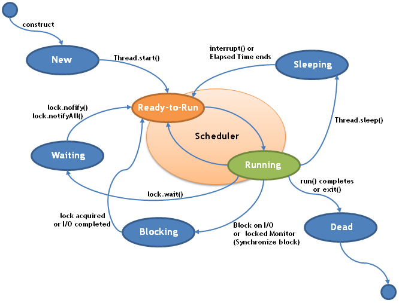

# 补3. 多线程 `Multithreading`

> Java is a multi-threaded programming language

1. Process and thread 进程和线程 多线程效率高
    - 进程是一个程序的执行过程类似一个容器。A process is an execution of a program and a thread is a single execution of work within the process. 
    - 线程执行程序的单元。A process can contain multiple threads. 
    - 程序分单线程和多线程A thread is also known as a lightweight process.
    - cpu 时间片段，线程多，占的片段就更多了。
2. Thread lifecycle 生命周期
    - 新建 `New`
    - 就绪 `Runnable`
    - 运行 `Running`
    - 阻塞 `Blocked`
        - 等待阻塞 `Waiting`
        - 同步阻塞 `Blocked on synchronization`
        - 其他阻塞
            - I/O
            - Sleep
            - Join  并入主线程
    -  死亡   `Dead`
    
    
    
3. Implementation实例
    - Extend `Thread` class  继承
        
        ```
        public class MT1 extends Thread {
        
            public static void main(String[] args) {
                MT1 mt1 = new MT1();
                mt1.start();//线程开启
                System.out.println("test...");
            }
        
            @Override
            public void run() {
                for (int i = 0; i < 10; i++) {
                    System.out.println(i);
                }
            }
        } 
        ```
        运行结果
        
        ```
            test
            0
            1
            2
            3
            4
            5
            6
            7
            8
            9
        ```
        
    - Implement `Runnable` interface
    
        ```
        //实现了接口
        public class MT2 implements Runnable {
            public static void main(String[] args) {
                MT2 mt2 = new MT2();
                //参数是Runnable接口的实现类
                Thread thread = new Thread(mt2);
                thread.start();
                System.out.println("test...");
            }
        
            @Override
            public void run() {
                for (int i = 0; i < 10; i++) {
                    System.out.println(i);
                }
            }
        }
        ```
        
4. join 合并加入

    ```java
    public class MT4 implements Runnable {
    
        public static void main(String[] args) {
    
            Thread thread = new Thread(new MT4());
            thread.setName("thread");
            thread.start();
    
            try {
                thread.join();//并入主线程 就变成单线程了
            } catch (InterruptedException e) {
                e.printStackTrace();
            }
    
            System.out.println("test...");
        }
    
        @Override
        public void run() {
            for (int i = 0; i < 3; i++) {
             //获取当前线程的命名
                System.out.println(Thread.currentThread().getName() + " is running...");
                try {//线程睡眠
                    Thread.sleep(1000 * 3);
                } catch (InterruptedException e) {
                    e.printStackTrace();
                }
            }
        }
    }

    ```
- windows 一个新线程默认占内存1M
    
```
    public class MT5 implements Runnable {
    
        public static void main(String[] args) {
    
            Thread thread1 = new Thread(new MT5());
            thread1.setName("thread 1");
            Thread thread2 = new Thread(new MT5());
            thread2.setName("thread 2");
            Thread thread3 = new Thread(new MT5());
            thread3.setName("thread 3");
    
            thread1.start();
            thread2.start();
    
            try {
                thread2.join(); //并入主线程
            } catch (InterruptedException e) {
                e.printStackTrace();
            }
    // thread2 main threa3
            thread3.start();
    
            System.out.println("test...");
        }
    
        @Override
        public void run() {
            for (int i = 0; i < 3; i++) {
                System.out.println(Thread.currentThread().getName() + " is running...");
                try {
                    Thread.sleep(1000 * 1);
                } catch (InterruptedException e) {
                    e.printStackTrace();
                }
            }
        }
    }
  
  //运行结果  thread 2并入主线程后，先执行thread 2中的内容，在执行主线程中thread 2下面的内容
// thread 2执行完后  thread 3才开始准备就绪
thread 1 is running...
thread 2 is running...
thread 1 is running...
thread 2 is running...
thread 1 is running...
thread 2 is running...
test...
thread 3 is running...
thread 3 is running...
thread 3 is running...
```
    
5. yield `[jiːld] 线程的静态方法 `    

    ```java
    public class MT6 implements Runnable {
    
        public static void main(String[] args) {
            Thread thread1 = new Thread(new MT6());
            thread1.setName("thread 1");
            Thread thread2 = new Thread(new MT6());
            thread2.setName("thread 2");
    
            thread1.start();
            thread2.start();
    
            System.out.println("test...");
        }
    
        @Override
        public void run() {
            for (int i = 0; i < 100; i++) {
                System.out.println(i + ": " + Thread.currentThread().getName() + " is running...");
                if (i % 10 == 0) {
                 //每10次，线程交换执行
                    Thread.yield();//放弃当前时间片 重新进入就绪状态
                }
            }
        }
    }
    ```

6. Thread priority 线程的优先级 越大执行机会越多 预期不太起作用
    - `MIN_PRIORITY` 1  最小优先级
    - `MAX_PRIORITY` 10
    - `NORMAL_PRIORITY` 5 默认的优先级 
    
    ```java
    public class ThreadPriority implements Runnable {
        @Override
        public void run() {
         // s缓存当前线程的名称和优先级
            System.out.println("running thread: " + Thread.currentThread().getName());
            System.out.println("thread priority: " + Thread.currentThread().getPriority());
        }
    
        public static void main(String[] args) {
            Thread thread1 = new Thread(new ThreadPriority());
            Thread thread2 = new Thread(new ThreadPriority());
            Thread thread3 = new Thread(new ThreadPriority());
    
            thread1.setName("thread1");
            thread2.setName("thread2");
            thread3.setName("thread3");
    
            thread1.setPriority(Thread.MIN_PRIORITY);
            thread2.setPriority(Thread.MAX_PRIORITY);
            thread3.setPriority(Thread.NORM_PRIORITY);
    
            thread1.start();
            thread2.start();
            thread3.start();
        }
    }
    ```
    
7. Synchronization 同步的 修饰关键字
    - synchronization method  同步方法
    - synchronization block  同步的块
    - HashMap 非同步的类 单线程使用 Hashtable 同步的 应用多线程
    - stringbuilder 非同步的 单线程用 快一些 Stringbuffer 同步的应用多线程
    
    - `synchronized` 作用域
        - 对象 / 实例 范围
          
          > 一个线程只能访问一个对象的 synchronized 方法，但其他线程可以访问另一个对象的同一方法
          
        - 类范围  也就是静态的方法
              
          > 一个线程只能访问一个类的一个 synchronized static 方法，对这个类的所有对象都适用
    
    ```java
   public class Synchronization {
       public static void main(String[] args) {
           Food water = new Food("water");
           //        Food fish = new Food("fish");
           //        Food bone = new Food("bone");
   
           Cat cat = new Cat("kitty", water);
           Dog dog = new Dog("tiger", water);
   
           cat.start();
           dog.start();
       }
   }
   //一共3个类
   class Food {
       private String name;
   
       Food(String name) {
           this.name = name;
       }
   //同步的方法
       synchronized void eat1() {
           System.out.println(Thread.currentThread().getName() + " is eating " + name);
           try {
               Thread.sleep(1000 * 5);
           } catch (InterruptedException e) {
               e.printStackTrace();
           }
       }
   //大家可以同时访问
       void eat2() {
        //同步的块  同一时刻只能一个线程访问
           synchronized (this) {
               System.out.println(Thread.currentThread().getName() + " is eating " + name);
               try {
                   Thread.sleep(1000 * 5);
               } catch (InterruptedException e) {
                   e.printStackTrace();
               }
           }
        //可能有其他代码 可以同时访问
       }
   //静态的同步方法 只能调用静态的变量  不同的对象依旧是不能同时访问
       synchronized static void eat3() {
           System.out.println(Thread.currentThread().getName() + " is eating...");
           try {
               Thread.sleep(1000 * 5);
           } catch (InterruptedException e) {
               e.printStackTrace();
           }
       }
   }
   
   class Cat extends Thread {
       private Food food;
   
       Cat(String name, Food food) {
           super(name);
           this.food = food;
       }
   
       @Override
       public void run() {
           food.eat1();//访问eat1的方法
   //        food.eat2();
   //        food.eat3();
       }
   }
   
   class Dog extends Thread {
       private Food food;
   
       Dog(String name, Food food) {
           super(name);
           this.food = food;
       }
   
       @Override
       public void run() {
           food.eat1();//访问eat1的方法
   //        food.eat2();
   //        food.eat3();
       }
   }

    ```
- 运行结果  同时喝水  分先后顺序

```
kitty is eating water
tiger is eating water
```
 
8. `wait` `notify` `notifyAll`  线程通信
    
    >  来自 `Object` 类，线程间通讯的方式

    - `wait`
        
        ```java
        public final void wait() throws InterruptedException
        ```
    
        - 当前线程阻塞
        - 等待其他线程调用 `notify` 或 `notifyAll`
        - 调用后，当前线程释放锁
        - 被唤醒后，重新竞争锁
        - 调用 `wait` 时，线程必须获得对象级别锁，即，在同步方法或同步块中
        - 如果调用时没有锁，抛 `IllegalMonitorStateException` 运行时异常
        
    - `notify`
    
        ```java
        public final native void notify()
        ```
        
        - 唤醒正在 wait 的线程，如有多个，挑选一个
        - 通知后，当前线程不会马上释放锁，wait 线程不会马上获得锁，需要等待当前线程退出同步区
        - 被唤醒的线程获得锁并执行完成，如果没有继续 notify，其他 wait 线程继续阻塞，等待被唤醒
        - 调用 `notify` 时，线程必须获得对象级别锁，即，在同步方法或同步块中
        - 如果调用时没有锁，抛 `IllegalMonitorStateException` 运行时异常
        
    - `notifyAll`
        
        ```java
        public final native void notifyAll()
        ```
        - 唤醒全部正在 wait 的线程
        - 当前线程退出同步区时，所有被唤醒线程竞争锁
        - 得到锁的线程执行完成同步区，其他线程继续竞争锁，直到全部执行完成
        - 调用 `notifyAll` 时，线程必须获得对象级别锁，即，在同步方法或同步块中
        - 如果调用时没有锁，抛 `IllegalMonitorStateException` 运行时异常
        
9. 生产者与消费者问题
    
   > Producer-consumer problem
   
   > 保证生产者不会在缓冲区满时加入数据，消费者也不会在缓冲区中空时消耗数据。
   
   ```
                                 +------------------+
                                 |                  |
                                 |                  |
                                 |                  |
                                 |                  |
                                 |                  |
                                 |                  |
                                 |                  |
   +-------------------+         |                  |         +------------------+
   |                   |         |                  |         |                  |
   |                   |         |                  |         |                  |
   |     Producer      | +-----> |      Buffer      | +-----> |     Consumer     |
   |                   |         |                  |         |                  |
   |                   |         |                  |         |                  |
   |                   |         |                  |         |                  |
   +-------------------+         |                  |         +------------------+
                                 |                  |
                                 |                  |
                                 |                  |
                                 |                  |
                                 |                  |
                                 |                  |
                                 +------------------+

   ```