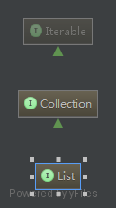
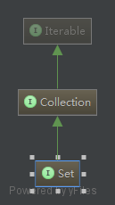
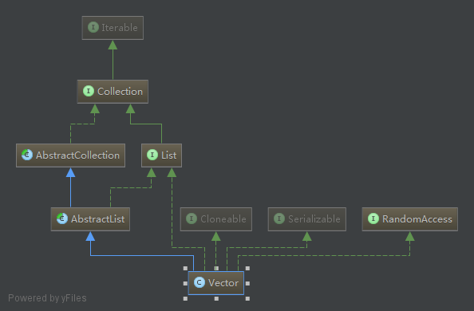
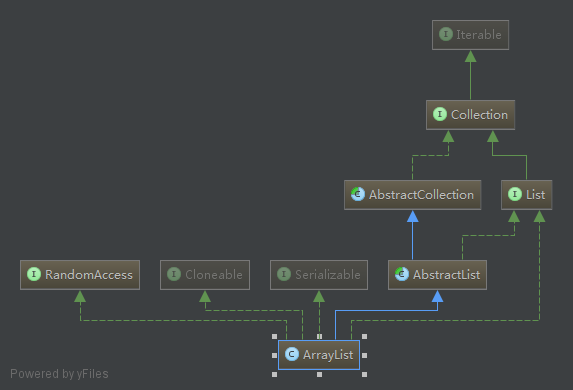
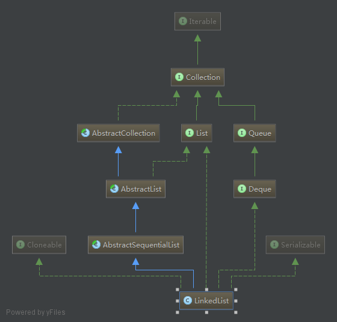

## 集合框架

> The `Java Collections Framework` is a collection of interfaces and classes which helps in storing and processing the data efficiently.

### Main Interfaces
- `Iterable`
- `Collection`
  - `List`
  
    
  
  - `Set`
  
    
  
- `Map`

### List

> 有序（序列）

> 可重复元素

- `Vector`
  
  
  
- **`ArrayList`**
  
  
  
  > constructors
  
  - ArrayList()
  - ArrayList(Collection<? extends E> c)
  - **ArrayList(int initicalCapacity)**
  
  > methods
  
  - **add**
  - **addAll**
  - **size**
  - clear
  - contains
  - ensureCapacity
  - **get**
  - indexOf
  - isEmpty
  - lastIndexOf
  - remove
  - removeRange
  - set
  - **size**
  - toArray
  - trimToSize
  
  > extended methods
  
  - equals
  - iterator
  - listIterator
  - subList [Converting a subList of an ArrayList to an ArrayList](http://stackoverflow.com/a/16644841/3414180)
  - containsAll
  - removeAll
  - removeIf `JDK 1.8`
  - retainAll [Why retainAll in ArrayList throws an Exception](http://stackoverflow.com/a/17564823/3414180)
  
- `LinkedList`
  
  
  
- ArrayList Vs LinkedList
  - Search: ArrayList search operation is pretty fast compared to the LinkedList search operation. get(int index) in ArrayList gives the performance of O(1) while LinkedList performance is O(n).

  > Reason: ArrayList maintains index based system for its elements as it uses array data structure implicitly which makes it faster for searching an element in the list. On the other side LinkedList implements doubly linked list which requires the traversal through all the elements for searching an element.

  - Deletion: LinkedList remove operation gives O(1) performance while ArrayList gives variable performance: O(n) in worst case (while removing first element) and O(1) in best case (While removing last element). Conclusion: LinkedList element deletion is faster compared to ArrayList.

  > Reason: LinkedList’s each element maintains two pointers (addresses) which points to the both neighbor elements in the list. Hence removal only requires change in the pointer location in the two neighbor nodes (elements) of the node which is going to be removed. While In ArrayList all the elements need to be shifted to fill out the space created by removed element.

  - Inserts Performance: LinkedList add method gives O(1) performance while ArrayList gives O(n) in worst case. Reason is same as explained for remove.

  - Memory Overhead: ArrayList maintains indexes and element data while LinkedList maintains element data and two pointers for neighbor nodes hence the memory consumption is high in LinkedList comparatively.
  