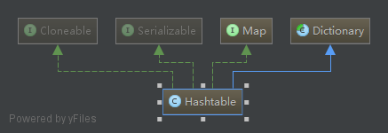
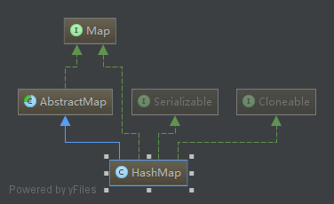
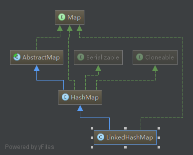
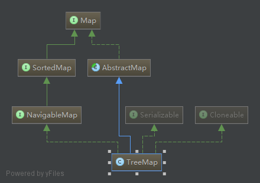
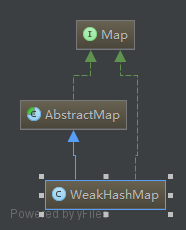
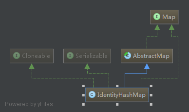
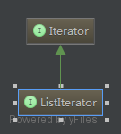

### Map

> `Key - Value` 对结构 哈希表 键值对
  
- `Hashtable`
  
  > 无序

  > `non-null` and key `non-null` value  都不能为空 键唯一
  
  
  
- `HashMap 用的比较多`

  > 无序
  
  > `null` key and `null` value 键和值可以为空
  
  
  
  ```
   HashMap<Integer, String> map = new HashMap<>();
      map.put(1, "hi");
      map.put(null, "hi");
      map.put(1, null);
      map.put(null, null);
  
      System.out.println(map.size());
  
      System.out.println(map.get(null));
      System.out.println(map.get(1));
  
     3种遍历的方法
      for (Integer integer : map.keySet()) {
          System.out.println(integer + "->" + map.get(integer));
      }
  
      for (String s : map.values()) {
          System.out.println(s);
      }
  
      for (Map.Entry<Integer, String> entry : map.entrySet()) {
          System.out.println(entry.getKey() + "->" + entry.getValue());
      }
  ```
  
- `LinkedHashMap`

  > 使用 `Hashtable` 实现

  > 按元素添加顺序排序
  
  > `null` key and `null` value  
  
  
  
- `TreeMap`

  > 使用 `红-黑 树` 存储元素

  > 按元素键的值排序

  > `non-null` key and `null` value
  
  
  
- ~~`WeakHashMap用的比较少`~~
  
  
  
- ~~`IdentityHashMap用的比较少`~~
  
  

### Iterator / ListIterator  提供循环服务的接口

- `Iterator  迭代器 比较常用`
- `ListIterator`  子接口

  
  
  ```
    ArrayList<Integer>list=new ArrayList<>();
      list.add(1);
      list.add(2);
      //    3种循环方式 Iterator声明类型 ArrayList内部的一个类
      Iterator<Integer>iterator=list.iterator();//接口实现类的实例
      while (iterator.hasNext()){
          System.out.println(iterator.next());
      }
  ```
listIterator 的使用方法
```
 List<Integer> list = new ArrayList<>();
        list.add(1);
        list.add(2);
        list.add(3);

        ListIterator<Integer> listIterator = list.listIterator();
//这个是向后遍历
        while (listIterator.hasNext()) {
            Integer next =  listIterator.next();
            System.out.println(next);
        }
        System.out.println("下面是向前遍历");
        while (listIterator.hasPrevious()) {
            System.out.println(listIterator.previous());
        }

```
#### Iterator Vs ListIetrator

- Iterator 可用于遍历 List 和 Set  因为它们实现了接口

  > ListIterator 只能遍历 List

- Iterator 只能向后遍历

  > ListIterator 能向前或向后遍历

- 使用 Iterator 不能获得 index

  > 使用 ListIterator 可以在任何时刻取得 index，使用 `nextIndex` 和 `previousIndex` 方法

- 使用 Iterator 遍历时不能添加元素，会抛出 `ConcurrentModificationException` 异常

  > 使用 ListIterator 遍历时可以使用 `add` 方法添加元素

- 使用 Iterator 时不能替换元素

  > 使用 ListIterator 可以使用 `set` 方法替换元素


- Iterator 的常用方法
  - hasNext
  - next
  - remove

```
这是它的使用方法  
 ArrayList<Integer>list=new ArrayList<>();
    list.add(1);
    list.add(2);
    //    3种循环方式 Iterator声明类型 ArrayList内部的一个类
    Iterator<Integer>iterator=list.iterator();//返回接口实现类的实例
    //  itit  迭代器的快捷键
    while (iterator.hasNext()){
        System.out.println(iterator.next());
    }
```
- ListIterator 的常用方法
  - add
  - hasNext
  - hasPrevious
  - next
  - nextIndex
  - previous
  - previousIndex
  - remove
  - set

### Utils  实用工具类接口
- `Collections 这个是一个静态类，给list，set，map 排序使用的`
    - reverse 反转
    - sort  排序 按元素的值排序
    - singletonList `ompare with Arrays.asList() 向比较`
    
    ```
    singletonList
    
    public static <T> List<T> singletonList(T o)
    返回一个只包含指定对象的不可变列表。返回的列表是可序列化的。
    参数：
    o - 将存储到返回列表中的单独对象。
    返回：
    一个只包含指定对象的不可变列表。
    从以下版本开始：
    1.3
    
      List<Integer>list=new ArrayList<>();
        list.add(1);
        list.add(2);
        list.add(3);
        System.out.println(list);   //  [1, 2, 3]
        for (Integer integer : list) {
            System.out.print(Collections.singletonList(integer));   //  [1][2][3]
        }
    ```
    运用的实例
    
    ```
      List<Integer> list = new ArrayList<>();
        list.add(-1);
        list.add(99);
        list.add(1);
    
    //        Collections.reverse(list); // reverse 反向\ [rɪ'vɜːs]
        Collections.sort(list); // sort 排序\ [sɔːt]
    
        for (Integer integer : list) {
            System.out.println(integer);
        }
    
        System.out.println(Collections.singletonList(list)); //[[-1, 1, 99]]
        System.out.println("->" + list);//->[-1, 1, 99]
        System.out.println(Arrays.asList(list));//[[-1, 1, 99]]
    
        Map<Integer, String> map = new HashMap<>();
        map.put(-1, "hi");
        map.put(100, "hello");
        map.put(1, "abcd");
    
        System.out.println(Collections.singletonList(map));//[{-1=hi, 1=abcd, 100=hello}]
        System.out.println("->" + map);//->{-1=hi, 1=abcd, 100=hello}
        System.out.println(Arrays.asList(map)); //[{-1=hi, 1=abcd, 100=hello}]
    ```
- `Arrays 数组的工具类`
    - asList
    
    ```
    asList
    
    public static <T> List<T> asList(T... a)  参数的意思是可以是多个参数
    返回一个受指定数组支持的固定大小的列表。（对返回列表的更改会“直接写”到数组。）此方法同 Collection.toArray() 一起，充当了基于数组的 API 与基于 collection 的 API 之间的桥梁。返回的列表是可序列化的，并且实现了 RandomAccess。
    此方法还提供了一个创建固定长度的列表的便捷方法，该列表被初始化为包含多个元素：
    
         List<String> stooges = Arrays.asList("Larry", "Moe", "Curly");
     
    参数：
    a - 支持列表的数组。
    返回：
    指定数组的列表视图。
    ```
    - binarySearch 实现二分查找 某一个值  前提是经过排序才可以 返回是排序后的结果的元素的索引 返回它的索引
    
    ```
     int[]ints={1,2,-1};
        Arrays.sort(ints);
    //    该方法运用前要先排序 返回的是排序后的坐标
        System.out.println(Arrays.binarySearch(ints,-1));
    ```
    这个方法的详细解释
    
    ```
    binarySearch
    
    public static int binarySearch(int[] a,
                                   int key)
    使用二分搜索法来搜索指定的 int 型数组，以获得指定的值。必须在进行此调用之前对数组进行排序（通过 sort(int[]) 方法）。如果没有对数组进行排序，则结果是不确定的。如果数组包含多个带有指定值的元素，则无法保证找到的是哪一个。
    参数：
    a - 要搜索的数组
    key - 要搜索的值
    返回：
    如果它包含在数组中，则返回搜索键的索引；否则返回 (-(插入点) - 1)。插入点 被定义为将键插入数组的那一点：即第一个大于此键的元素索引，如果数组中的所有元素都小于指定的键，则为 a.length。注意，这保证了当且仅当此键被找到时，返回的值将 >= 0。
    ```
    - copyOf  数组复制一部分元素
    - copyOfRange
    - equals 判断是否相等 
    - fill  填充 数据全部改变
    
    ```
  fill
  
  public static void fill(long[] a,
                          long val)
  将指定的 long 值分配给指定 long 型数组的每个元素。
  参数：
  a - 要填充的数组
  val - 要存储在数组所有元素中的值  
    ```
    - sort  排序
    - toString  输出全部数组
    
    ```
    toString     返回的数组样式  [-10000, -1, 1, 100, 1000]
    
    public static String toString(int[] a)
    返回指定数组内容的字符串表示形式。字符串表示形式由数组的元素列表组成，括在方括号（"[]"）中。相邻元素用字符 ", "（逗号加空格）分隔。这些元素通过 String.valueOf(int) 转换为字符串。如果 a 为 null，则返回 "null"。
    参数：
    a - 返回其字符串表示形式的数组
    返回：
    a 的字符串表示形式
    从以下版本开始：
    1.5
    ```
    - deepToString  二维数组以字符串形式输出
    
    ```
    int[][] ints1 = {
             {1, -1, 10},
             {-2, -3},
             {3, 2, 1, 0}
     };
     System.out.println(Arrays.deepToString(ints1));
     
     输出的格式  [[1, -1, 10], [-2, -3], [3, 2, 1, 0]]
    ```
