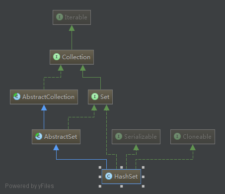
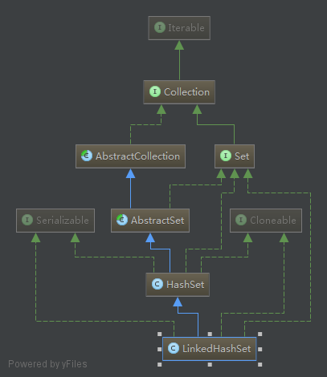
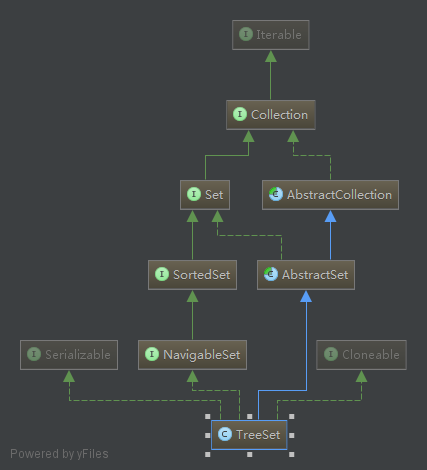

### Set

> 不可重复元素

- `HashSet`

  > 使用 `HashMap` 存储元素

  > 无序

  > 效率高
  
  
  
- `LinkedHashSet`

  > 使用 `HashMap` 实现

  > 按元素添加顺序排序
  
  
  
- `TreeSet`

  > 使用 `红-黑 树` 存储元素

  > 按元素值排序
  
  
  
  