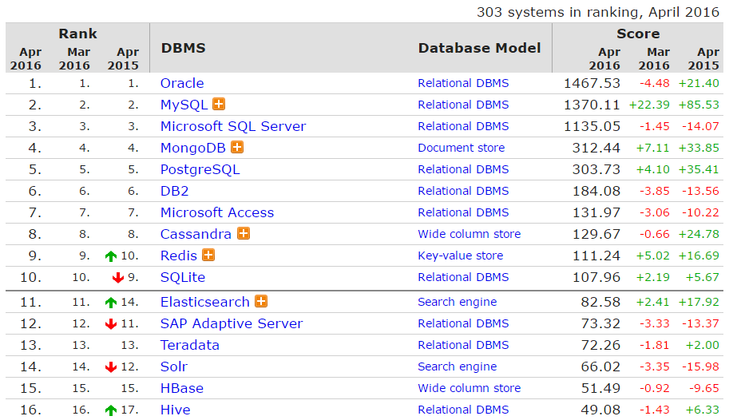

# Chapter 1 引言

1. 历史发展
    - 人工管理
    - 文件管理 比如谷歌文件系统
        - 超大规模数据 一亿条数据以上
    - 数据库 安全性好
        - 不适于超大规模数据
        - 不适于超大规模并发 同一时刻同时访问的人数
2. DBMS  Datavase Management system
  - Oracle  甲骨文公司开发
  - MySQL /maɪ ˌɛskjuːˈɛl/  RDBMS Relatiional 关系型数据库
  - SQL Server  微软公司开发
  - `MongoDB`  No-SQL
  - PostgreSQL
  - DB2
  - Access
  - `Cassandra`
  - `Redis`
  - SQLite  手机中使用
  - `Elasticsearch`
  - SAP Adaptive Server
  - Teradata
  - `Solr`
  - `HBase`
  - Hive

  > [DB-Engines Ranking](http://db-engines.com/en/ranking)
   
  

  - RDBMS

    > Relational Database Management System 关系型数据库管理系统
    
    > Entity Relationship
    
  - NoSQL  都不使用SQL语言
    
    > key - value / 文档 / 列存储 / 图型 / XML
    
    - MongoDB
    - Cassandra
    - Redis

## 基本概念
1. Database

  > Database - A container (usually a file or set of files) to store organized data.

2. Table

  > A structured list of data of a specific type.
 
3. Schema

  > Information about database and table layout and properties.

4. Column

  > A single field in a table. All tables are made up of one or more columns.

5. Datatype

  >  A type of allowed data. Every table column has an associated datatype that restricts (or allows) specific data in that column.

6. Row行

  > A record in a table.

7. Primary key主键

  >  A column (or set of columns) whose values uniquely identify every row in a table.

8. SQL ` ['siːkwəl]`

  - SQL is not a proprietary language used by specific database vendors. Almost every major RDBMS supports SQL, so learning this one language enables you
to interact with just about every database you'll run into.

  - SQL is easy to learn. The statements are all made up of descriptive English words, and there aren't that many of them.
 
  - Despite its apparent simplicity, SQL is actually a very powerful language, and by cleverly using its language elements you can perform very complex and
sophisticated database operations.
  