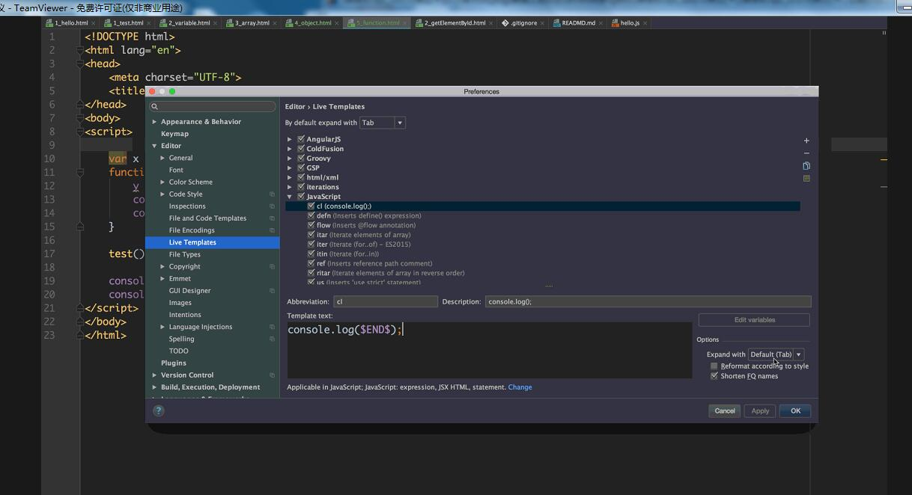
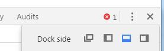

### 如果一种功能的代码，你从来没有敲过，那么你永远多学不会，当你真正自己能会的时候，你在采用复制来提高效率。

### 项目的地址 [JavaScript_20170902](https://github.com/tanyinqing/JavaScript_20170902)
|名称|描述|地址|
|---|---|---|
|1_hello.html|初步认识JavaScript|[地址](https://github.com/tanyinqing/JavaScript_20170902/blob/master/1_hello.html)|
|2_getElementById.html|根据id获取h5中的元素|[地址](https://github.com/tanyinqing/JavaScript_20170902/blob/master/2_getElementById.html)|

### 第二天 
|名称|描述|地址|
|---|---|---|
|1_test|JavaScript输出|[地址](https://github.com/tanyinqing/JavaScript_20170902/blob/master/day2/1_test.html)|
|2_variable|JavaScript变量|[地址](https://github.com/tanyinqing/JavaScript_20170902/blob/master/day2/2_variable.html)|
|3_array|JavaScript数组|[地址](https://github.com/tanyinqing/JavaScript_20170902/blob/master/day2/3_array.html)|
|4_object|JavaScript的对象|[地址](https://github.com/tanyinqing/JavaScript_20170902/blob/master/day2/4_object.html)|
|5_function|JavaScript的函数|[地址](https://github.com/tanyinqing/JavaScript_20170902/blob/master/day2/5_function.html)|
|6_for-in|JavaScript遍历|[地址](https://github.com/tanyinqing/JavaScript_20170902/blob/master/day2/6_for-in.html)|

### 第三天 
|名称|描述|地址|
|---|---|---|
|1_validate|JavaScript用于表单的非空验证|[地址](https://github.com/tanyinqing/JavaScript_20170902/blob/master/day3/1_validate.html)|
|2_DOM|JavaScript用于dom节点|[地址](https://github.com/tanyinqing/JavaScript_20170902/blob/master/day3/2_DOM.html)|
|3_focus-blur|JavaScript用于监听事件|[地址](https://github.com/tanyinqing/JavaScript_20170902/blob/master/day3/3_focus-blur.html)|
|4_ttt|用JavaScript绘制九宫格|[地址](https://github.com/tanyinqing/JavaScript_20170902/blob/master/day3/4_ttt.html)|
|5_number|8进制与16进制10进制区别|[地址](https://github.com/tanyinqing/JavaScript_20170902/blob/master/day3/5_number.html)|
|6_date|JavaScript对象日期类|[地址](https://github.com/tanyinqing/JavaScript_20170902/blob/master/day3/6_date.html)|
|7_clock|做一个时间秒表|[地址](https://github.com/tanyinqing/JavaScript_20170902/blob/master/day3/7_clock.html)|
|8_time_remaind|一个人还能活多长时间|[地址](https://github.com/tanyinqing/JavaScript_20170902/blob/master/day3/8_time_remaind.html)|
|9_math|随机数|[地址](https://github.com/tanyinqing/JavaScript_20170902/blob/master/day3/9_math.html)|
|10_Array|数组对象的方法|[地址](https://github.com/tanyinqing/JavaScript_20170902/blob/master/day3/10_Array.html)|
|11_boolean|逻辑对象的方法|[地址](https://github.com/tanyinqing/JavaScript_20170902/blob/master/day3/11_boolean.html)|
|12_RegExp|正则表达式的用法|[地址](https://github.com/tanyinqing/JavaScript_20170902/blob/master/day3/12_RegExp.html)|

# JavaScript

> 教学要求

1. JavaScript 基本语法 按照网站上的将
2. JavaScript 与 Java 的异同

> 课外参考

1. [W3 School](http://www.w3schools.com/js/default.asp)
2. [h5中文版翻译网站](http://w3school.com.cn/)

> outline

1. [引言](intro.md)
2. [练习题](exercise.md)

- Setting languages&Frameworks JavaScript 设置它的版本 目前版本是6 

- JavaScript属于前端的内容 2到3天
- jQuery 1到2天
- JavaScript+Java EE/.net/Python/PHP/Go 从前前端加后台
- JavaScript+Node.js 现在服务器开发
- 动物出版社  JavaScript权威指南 这本书
- ECMA 欧洲计算机标准协会
- ECMA-262 是 JavaScript 标准的官方名称。

- 动态模板设置 live template console.log($END$);  console.log(); cl

- 控制台位置设置

